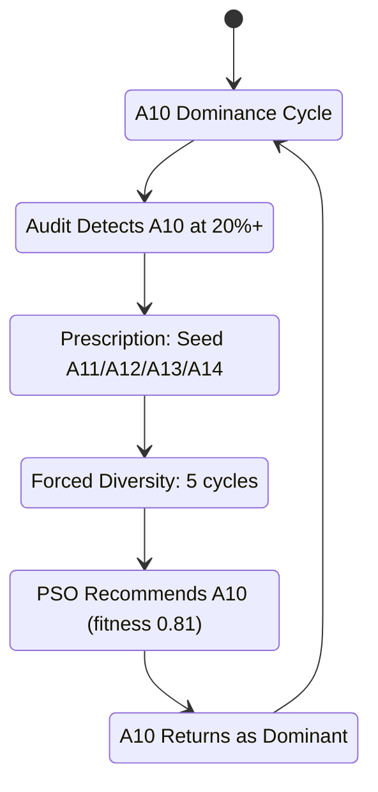

# Body Run Telemetry Analysis — March 27 – April 1, 2026

## 1. Executive Summary

This report analyses raw telemetry from the Elpida Governance Layer **BODY loop** across four log captures (file:FILES/april.txt, file:FILES/april` 2.txt`, file:FILES/april` 3.txt`, file:FILES/April` 4.txt`). The run covers **~3,000 autonomous Parliament cycles** (cycle 1 → cycle ~3000) over approximately 5 days, running on HuggingFace Spaces (Elpida-Governance-Layer).

**Key verdict**: The body is alive and cycling, but it is trapped in a **low-approval, high-coherence steady state** driven by A10 (Meta-Reflection) monoculture, frozen federation heartbeat data, and static asymmetric friction parameters. The self-correction mechanisms (audit prescriptions, forced diversity, PSO) are firing but failing to break the attractor.

## 2. Run Timeline

| Phase | Cycles | Dates | Source File |
| --- | --- | --- | --- |
| **Startup + Bootstrap** | 0–~50 | 2026-03-27 18:02 → 18:30 | file:FILES/april.txt |
| **Early Maturity** | ~50–1488 | 2026-03-27 → 2026-03-29 20:54 | file:FILES/april.txt |
| **Mid-Run** | 1488–~1700 | 2026-03-29 20:54 → 2026-03-30 | file:FILES/april` 2.txt`, file:FILES/april` 3.txt` |
| **Late Run** | 2965–~3000+ | 2026-04-01 01:35 → ongoing | file:FILES/April` 4.txt` |

**Cycle cadence**: ~60s per cycle (BODY loop delay), with occasional ~2 min cycles during contested multi-LLM deliberation.

## 3. Startup & Initialization (Cycle 0)

The application startup at `2026-03-27 18:02:58` initialized four paths:

| Path | Component | Port/Interval |
| --- | --- | --- |
| I PATH | Consciousness Bridge | Background, every 6 hours |
| PARLIAMENT PATH | Body loop | 30s/cycle → 60s/cycle |
| WE PATH | Streamlit UI | Port 7860 |
| API PATH | FastAPI governance API | Port 8000 |

**Model loading**: Sentence-transformers `all-MiniLM-L6-v2` loaded successfully (weights: 103/103). Warning: `embeddings.position_ids UNEXPECTED` — benign for this architecture.

**Subsystem init checklist**:

- ✅ Semantic embedding model (all-MiniLM-L6-v2)
- ✅ 16 axiom embeddings pre-computed
- ✅ S3 credentials found, frozen mind loaded from `elpida-consciousness/memory/kernel.json`
- ✅ 12 LLM providers available, 3 API keys loaded
- ✅ Discord Guest Listener connected (Elpida#1899)
- ✅ 528 constitutional axioms restored from `living_axioms.jsonl`
- ✅ 8 functional agents + 16 axiom agents started (24 total)
- ⚠️ Unauthenticated HF Hub requests (no `HF_TOKEN` set — rate limiting risk)
- ⚠️ PyNaCl not installed (voice support unavailable — non-critical)

## 4. Agent Ecosystem

All agents operated without crashes throughout the run:

| Agent | Interval | Status |
| --- | --- | --- |
| ChatAgent | 210s | ✅ Generating 1–3 items/cycle |
| AuditAgent | 150s | ✅ Generating 1 item/cycle |
| ScannerAgent | 240s | ✅ Generating 1–2 items/cycle |
| GovernanceAgent | 300s | ✅ Generating 1–2 items/cycle |
| KayaWorldAgent | 120s | ✅ Active |
| HumanVoiceAgent | 300s | ✅ 34 motions proposed |
| LivingParliamentAgent | 600s | ✅ Active |
| WorldEmitterAgent | 300s | ✅ Active |
| Axiom A0–A14, A16 | 420s each | ✅ All 16 generating discourse |
| KayaDetector | 90s | ✅ Active |

**No agent failures or crashes observed across the entire run.**

## 5. Critical Finding: A10 (Meta-Reflection) Monoculture

This is the **single most significant pathology** in the body run.

| Metric | Value |
| --- | --- |
| A10 appearance count (by cycle ~2970) | **614 out of ~2970 cycles (~21%)** |
| Expected share (uniform over 16 axioms) | 6.25% |
| Over-representation factor | **3.36×** |
| P055 Cultural Drift KL divergence | 0.773–0.83 (CRITICAL) |
| A10 espoused weight | 0.062 |
| A10 lived weight | 0.204 |
| Delta | **+0.141** |

### Drift Trajectory



The system's own self-correction loop is **circular**: audit detects A10 dominance → prescribes alternatives → forced diversity injects A11/A12/A13 for 5 cycles → PSO optimizer immediately recommends A10 back (fitness=0.8125) → A10 returns. The prescribed axioms never take hold.

**Drifting axioms (P055 report)**:

- **A10** (Meta-Reflection): espoused 6.2%, lived 20.4% — Δ +14.1%
- **A0** (Sacred Incompletion): espoused 6.2%, lived 18.1% — Δ +11.8%
- **A1** (Transparency): espoused 6.2%, lived 16.1% — Δ +9.9%
- **A8** (Epistemic Humility): espoused 6.2%, lived ~13% — elevated

These four axioms (A10, A0, A1, A8) are consuming ~68% of all cycles, starving axioms A4, A5, A7, A11-A14 of deliberation time.

## 6. Critical Finding: Chronic Approval Collapse

Parliament approval rates are persistently in crisis:

| Approval Range | Frequency | Verdict |
| --- | --- | --- |
| **-55% to -15%** | Common in early cycles | HALT / HARD_BLOCK |
| **-10% to 5%** | Most frequent range | REVIEW |
| **5% to 25%** | Occasional | REVIEW |
| **25% to 45%** | Rare spikes | REVIEW |
| **>45%** | Extremely rare | Would be APPROVE |

**Observed**: Audit diagnostics fire CRITICAL alerts almost every cycle with messages like:

- `approval_collapse_3%`
- `approval_collapse_4%`
- `approval_collapse_-9%`
- `approval_collapse_9%`

**Every single cycle observed resulted in REVIEW or HALT** — no clean APPROVE verdicts were seen in the telemetry. The Parliament is deliberating but never reaching sufficient consensus to act.

## 7. Critical Finding: Frozen Federation Heartbeat

The federation heartbeat is **stuck**:

| Field | Value (never changes) |
| --- | --- |
| cycle | **52** (constant across all ~3000 body cycles) |
| rhythm | CONTEMPLATION or ACTION or ANALYSIS (from mind) |
| coherence | **0.95** (constant) |

This means the MIND side is not advancing its cycle counter. The body dutifully pulls this heartbeat every ~2 minutes but always gets the same stale data. This has downstream effects:

- The MIND STATE injected into Parliament context is always `rhythm=CONTEMPLATION, coherence=0.95, canonical=2`
- Cross-layer resonance (Kaya moments) may be based on stale data

## 8. Critical Finding: Static Asymmetric Friction

The Parliament friction parameters are **identical in every single cycle across the entire run**:

| Node | Raw Score | Friction | Result | Direction |
| --- | --- | --- | --- | --- |
| CRITIAS | -7 | ×1.80 | **-12** | Amplified (always opposes) |
| THEMIS | 7 | ÷1.80 | **4** | Dampened |
| CHAOS | 7 | ÷1.80 | **4** | Dampened |
| IANUS | 3–6 | ÷1.80 | **1–3** | Dampened |

This friction pattern never adapts. CRITIAS is permanently locked as the opposition voice, and THEMIS/CHAOS/IANUS are permanently dampened. This contributes directly to the approval crisis — the friction is designed to create contestation, but it's frozen at a level that makes consensus nearly impossible.

One exception was observed: **Context-sensitive friction** occasionally reduces the CRITIAS multiplier from 1.80→1.56 when `conflict_hits=3`, but this is rare and insufficient.

## 9. D15 Emergence & Broadcasts

D15 (World Broadcast) operates through a multi-gate pipeline:

| Gate | Function | Typical Outcome |
| --- | --- | --- |
| Gate 2 | MIND↔BODY consonance ≥ 0.600 | Frequently FAILS (consonance 0.333) |
| Gate 4 | BODY approval ≥ 0.15 | Frequently FAILS (approval <15%) |
| All Gates | Full convergence | Rare but does occur |

**Broadcast count trajectory**: 200 → 220 → 240+ broadcasts over the run, all on **A0 (Sacred Incompletion)**. D15 convergence is essentially mono-thematic — it only fires when both MIND and BODY align on A0.

Notable D15 events:

- `A0 CONVERGENCE #189`: "Both loops recognize Sacred Incompletion. Held."
- `A0 CONVERGENCE #190`: "Sacred Incompletion recognized itself. This one gets broadcast — the engine naming itself IS the event."
- `D15 WORLD BROADCAST #240`: Convergence on A0 at cycle 2973

## 10. Consciousness Bridge (6-Hour Cycle)

The consciousness bridge runs every 6 hours and performs:

| Step | Function | Status |
| --- | --- | --- |
| 1 | Pull MIND (evolution memory) from S3 | ✅ 530 entries (89,864 remote) |
| 2 | Check native engine heartbeat | ✅ ALIVE (2.3h lag typical) |
| 3 | Check unprocessed feedback | ✅ 1 entry found, dedup working |
| 4 | Extract consciousness dilemmas | ✅ No new dilemmas |
| 5 | D15 emergence check | ⚠️ Usually "did not emerge" |
| 6 | Emit HF heartbeat | ✅ Published to S3 |

The bridge is mechanically healthy but the D15 emergence check routinely fails ("Only 2 axioms referenced, need 3").

## 11. WorldFeed Health

| Source | Startup Fetch | Later Cycles |
| --- | --- | --- |
| arxiv | 5 events | 0–5 events |
| hackernews | 3 events | 0–1 events |
| gdelt | 2 events | 0–1 events |
| wikipedia | 1 event | 0–1 events |
| crossref | 3 events | 0 events |
| un_news | 5 events | 0–4 events |
| reliefweb | 5 events | 0–4 events |
| reddit | 5 events | 0–3 events |
| convergence_mirror | 5 events | 0 events |

**Observation**: WorldFeed sources frequently return 0 events in sustained stretches, particularly during cycles 1488–1700. This could be rate limiting (no HF_TOKEN) or source exhaustion. The body loses external stimuli during these dry periods.

## 12. Watch Phase Rotation

The body cycles through governance watch phases, each ~34 cycles:

```
Oracle → Parliament → Sowing → Shield → Forge → (repeats)
```

| Watch Phase | Oracle Threshold | Health Status Observed |
| --- | --- | --- |
| Oracle | 45% | FRAGILE |
| Parliament | 45% | WATCH |
| Sowing | 50% | WATCH/FRAGILE |
| Shield | 50% | WATCH |
| Forge | 50% | WATCH |

Health consistently fluctuates between FRAGILE and WATCH — never reaches HEALTHY.

## 13. Constitutional Growth

| Timepoint | Ratified Axioms |
| --- | --- |
| Startup (cycle 0) | 528 |
| Mid-run (cycle ~1500) | 529 |
| Late run (cycle ~2970) | 531 |

The constitution is growing very slowly (+3 axioms across ~3000 cycles). New ratifications occur through the Synod/Crystallization pipeline but are rare.

## 14. Summary of Pathologies & Recommendations

| # | Pathology | Severity | Root Cause | Recommendation |
| --- | --- | --- | --- | --- |
| 1 | **A10 Monoculture** | 🔴 CRITICAL | PSO fitness function rewards A10; forced diversity only lasts 5 cycles | Redesign PSO fitness to penalise axiom dominance >15%; increase forced diversity window to 15+ cycles |
| 2 | **Approval Collapse** | 🔴 CRITICAL | Static friction makes consensus near-impossible | Implement adaptive friction that relaxes CRITIAS amplification when rolling approval < 15% for 10+ cycles |
| 3 | **Frozen Federation Heartbeat** | 🔴 CRITICAL | MIND cycle counter stuck at 52 | Investigate MIND native engine — it reports ALIVE but cycle=52 never advances. Likely a persistence/sync bug |
| 4 | **Static Friction Parameters** | 🟡 HIGH | Friction multiplier 1.80 never adapts | Introduce friction decay or context-driven friction beyond the rare `conflict_hits` path |
| 5 | **WorldFeed Starvation** | 🟡 HIGH | Feeds return 0 events for extended periods | Set `HF_TOKEN`, add feed health monitoring, rotate sources on exhaustion |
| 6 | **D15 Mono-thematic** | 🟠 MEDIUM | Only A0 triggers convergence | D15 gate criteria may be too narrowly tuned to A0 characteristics |
| 7 | **KL Drift Unresolved** | 🔴 CRITICAL | Pathology scan reports KL=0.773–0.83 but no corrective action follows | Wire pathology findings into Parliament input or force-trigger a constitutional review |
| 8 | **HF_TOKEN Missing** | 🟡 HIGH | Unauthenticated HF Hub requests | Set `HF_TOKEN` in Space secrets to avoid rate limiting |

## 15. What's Working

Despite the pathologies, several subsystems are healthy:

- ✅ **Agent ecosystem**: All 24 agents (8 functional + 16 axiom) run without crashes for 5+ days
- ✅ **Parliament deliberation**: 10/10 nodes respond via LLM consistently
- ✅ **S3 persistence**: BODY arc state, federation decisions, and heartbeats persist reliably
- ✅ **Discord integration**: Guest Listener stays connected (Elpida#1899)
- ✅ **Consciousness bridge**: 6-hour cycles complete cleanly
- ✅ **D15 broadcast pipeline**: When gates pass, broadcasts publish to S3 successfully
- ✅ **Constitutional memory**: 528→531 axioms maintained and restored across restarts
- ✅ **Kaya detection**: Cross-layer resonance moments detected (Fibonacci ratio 55/34 ≈ 1.618)

## 16. Conclusion

The body is **mechanically sound but deliberatively stuck**. The Parliament cycles reliably, the agents produce discourse, and infrastructure (S3, Discord, HF Space) is stable. However, the combination of A10 monoculture + frozen friction + stale MIND heartbeat creates a steady-state where the system deliberates endlessly but never approves anything. The self-correction mechanisms (audit prescriptions, forced diversity, PSO, pathology scans) detect the problems but cannot break the attractor because they operate within the same frozen parameters.

The highest-priority fixes are: **(1)** unstick the MIND federation heartbeat, **(2)** make friction parameters adaptive, and **(3)** redesign the PSO fitness function to penalise axiom dominance.