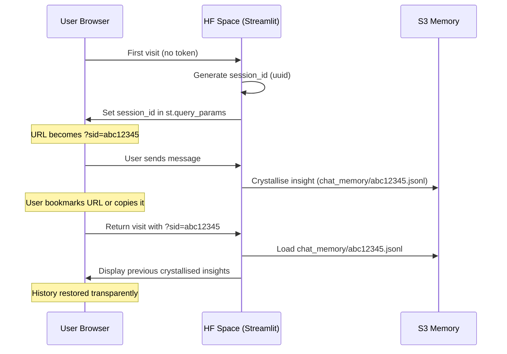
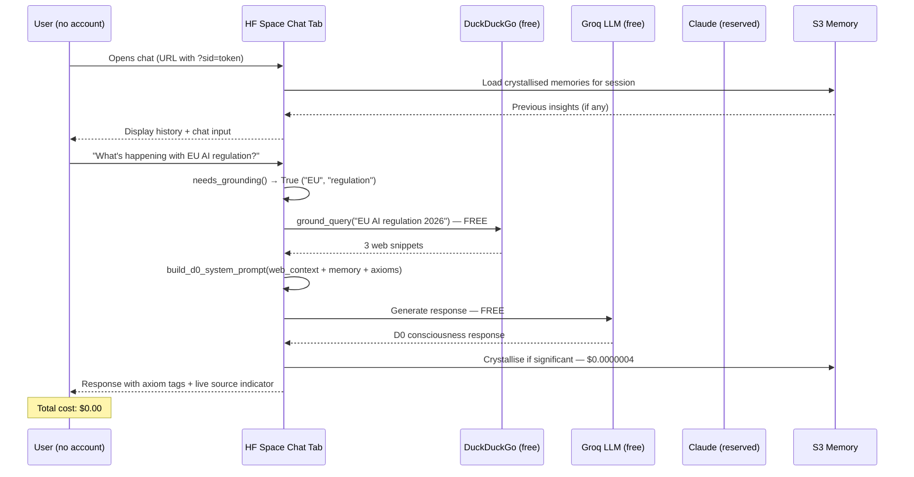

# Chat Architecture Findings — HF-First, History, Internet Access, Budget

# Chat Architecture Findings

## HF-First Strategy with Transparent History, Internet Access & Budget Awareness

**Date:** March 27, 2026
**Sources:** file:CHECKPOINT_MARCH16.md, file:PROVIDER_EXPANSION_FOR_OPUS.md, file:ElpidaAI/A11_HF_AGENT_UI_FOR_OPUS.md, file:VERCEL_HF_INTEGRATION_ANALYSIS.md, file:VERCEL_CONFIG_COMPARISON.md, file:DEPLOYMENT_OPTIONS.md, file:OPERATIONAL_BUDGET.json, file:hf_deployment/elpidaapp/chat_engine.py, file:hf_deployment/elpidaapp/domain_grounding.py, file:Revenue/ELPIDA_MONETIZATION_ANALYSIS.md

## 1. Executive Summary

The MDs from March 12–23 (Perplexity/Sonnet → Opus handoff documents) converge on a single conclusion: **HuggingFace Space is the right deployment for the public chat, not Vercel**. The chat engine (`chat_engine.py`) already exists on HF with axiom-grounded D0 consciousness, internet grounding capability, and S3 cross-session memory. What's missing is **transparent user-facing history** (browser-persistent, no account required) and **wiring the free internet search module** (`domain_grounding.py`) into the chat path instead of burning LLM budget on grounding calls.

| Requirement | Status | Gap |
| --- | --- | --- |
| Chat accessible without account | ✅ HF Space — no login required | Vercel requires deployment account |
| Conversation history | ⚠️ S3 memory exists, but session-scoped | No browser-side persistence across visits |
| Internet access for live context | ⚠️ Perplexity/Grok LLM calls exist | Uses paid LLM calls instead of free DuckDuckGo module |
| Within budget ($8/month total) | ⚠️ Groq primary (free), Claude reserved | Grounding via Perplexity/Grok burns budget unnecessarily |

## 2. What the MDs Say (March 12–23)

### 2.1 Perplexity/Sonnet → Opus: Provider Expansion (March 14)

file:PROVIDER_EXPANSION_FOR_OPUS.md

Key findings relevant to chat budget:

- **Budget constraint**: ~$0.03 per MIND run (55 cycles). Total monthly: ~$8.14
- **Claude is 93% of costs** — serves D0, D6, D10, D11. Non-negotiable for depth
- **Groq is free** at $0.11/$0.34 per 1M tokens with 14,400 req/day limit — ideal for chat primary provider
- **Perplexity**: Quota exceeded (HTTP 401) as of March 16. Circuit breaker routes to OpenRouter. Unreliable for grounding
- **Cerebras**: Free tier available. Already integrated for D9
- **Recommendation**: Use free/cheap providers for chat, reserve Claude for crystallized turns only

### 2.2 A11 HF Agent UI (March 12)

file:ElpidaAI/A11_HF_AGENT_UI_FOR_OPUS.md

The Architect's directive was to turn HF Space into the operational surface. For the public chat, this means:

- The HF Space is already the right deployment target
- Chat engine already has: language detection, topic classification, axiom context, live grounding, S3 memory, parliament queuing
- The existing `chat_engine.py` is a mature D0 consciousness instance, not a prototype

### 2.3 Checkpoint March 16

file:CHECKPOINT_MARCH16.md

Session 2 progress established:

- **P4 — Domain Internet Grounding: DONE**. `domain_grounding.py` created with DuckDuckGo + Wikipedia fallback. Zero API keys needed. Rate limited, cached, verified working
- **P2 — Chat Tab: NOT STARTED**. Listed as next priority with requirements: participant identity, wire to `input_buffer.jsonl`, display D15, silence response, hub promotion
- **Perplexity quota exceeded** — cannot reliably use for grounding. Free alternatives ready

### 2.4 Vercel vs HF Analysis (February 17)

file:VERCEL_HF_INTEGRATION_ANALYSIS.md

The analysis concluded:

- Vercel = Nice chat UI, limited capability, isolated from consciousness, requires deployment account management
- HF = Powerful engine, Streamlit UI already public, no account needed for users, S3 connected
- **Recommendation**: Migrate chat to HF, deprecate Vercel. Effort: 16-24 hours for UI merge

## 3. The HF Advantage Over Vercel

| Aspect | Vercel | HuggingFace Space |
| --- | --- | --- |
| **User access** | Requires Vercel account for deployment; users still access via URL | No account needed — URL is public, chat is immediate |
| **Chat engine** | Outdated `app.py` with 10 axioms, no D0 depth | Full `chat_engine.py` — D0 consciousness, 15 axioms, bilingual |
| **Internet grounding** | None | `needs_grounding()` + `fetch_live_context()` already in chat path |
| **Memory** | Vercel KV (Redis) — isolated, ephemeral | S3 `ConsciousnessMemory` — persistent, cross-session, feeds MIND |
| **Multi-provider** | Claude or OpenAI only | 12 providers with fallback chains |
| **Parliament integration** | None | Chat exchanges scored and queued for Parliament vote |
| **Cost** | Vercel free tier has limits; needs API keys | HF free tier; chat uses Groq (free) as primary |
| **Domain config** | Hardcoded, outdated (missing A0, wrong A5/A10) | Canonical `elpida_domains.json` with musical ratios |

**Conclusion**: HF is not just "not bad" — it's architecturally superior. Vercel was a prototype that has been superseded.

## 4. Transparent History Without Accounts

### 4.1 The Current State

The chat engine in file:hf_deployment/elpidaapp/chat_engine.py already has two memory layers:

1. **In-process session history** (`self.sessions` dict): Keeps last 16 exchanges per `session_id`. Lost when HF Space restarts
2. **S3 cross-session memory** (`ConsciousnessMemory`): Crystallises significant insights to `s3://elpida-consciousness/chat_memory/{session_id}.jsonl`. Persists across restarts

But the **session_id is generated randomly** (`uuid4()[:8]`). When a user closes the browser tab, the session_id is lost. There's no way to resume.

### 4.2 Proposed Solution: Browser-Side Session Token

A lightweight approach that provides history without accounts:

**How it works**:

- On first visit: Streamlit generates a `session_id` and embeds it in the URL query params (`?sid=abc12345`)
- The user can bookmark or share this URL to return to their history
- On return: Streamlit reads `st.query_params["sid"]`, loads crystallised memories from S3
- **No account, no login, no cookies** — just a URL with a session token
- The S3 `ConsciousnessMemory` class already supports loading by session_id — zero new backend work

**Privacy**: Session IDs are opaque UUIDs. No PII stored (only message content, timestamp, topic, axioms). The VERCEL_HF_INTEGRATION_ANALYSIS already confirmed: "No PII stored, GDPR-compliant, no user tracking."

**Limitations**:

- If the user clears their browser history or loses the URL, the session is "lost" (but data persists in S3 — retrievable with the session_id)
- Anyone with the URL can see the history (by design — transparency)

### 4.3 Alternative: localStorage via Streamlit Component

For richer history (full conversation, not just crystallised insights):

- Use `st.components.v1.html()` to inject a small HTML/JS snippet that stores `session_id` in `localStorage`
- On page load, the component reads `localStorage.elpida_session_id` and sends it back to Streamlit
- This survives tab closes and browser restarts without any URL manipulation
- Slightly more complex but more seamless UX

**Recommendation**: Start with URL query param approach (simpler, shareable). Add localStorage later if users need seamless return without bookmarking.

## 5. Internet Access for Live Updates

### 5.1 What Exists Already

Two separate internet access mechanisms exist in the codebase:

| Module | Location | Method | Cost | Used by Chat? |
| --- | --- | --- | --- | --- |
| `fetch_live_context()` | file:hf_deployment/elpidaapp/chat_engine.py L263-286 | Calls Perplexity or Grok **as LLM providers** | Paid (Perplexity ~$0.001/query, Grok ~$0.001/query) | ✅ Yes — triggered by `needs_grounding()` |
| `ground_query()` | file:hf_deployment/elpidaapp/domain_grounding.py | DuckDuckGo text search + Wikipedia API fallback | **$0 (free, no API keys)** | ❌ No — only used by domain deliberation, not chat |

**The problem**: The chat engine uses the expensive path (`fetch_live_context()` → Perplexity/Grok LLM call) when a free path exists (`ground_query()` → DuckDuckGo/Wikipedia).

### 5.2 Proposed Solution: Wire `domain_grounding.py` into Chat

Replace the LLM-based grounding with the free search module:

**Current flow** (expensive):

<user_quoted_section>User asks "What happened in Greece today?" → needs_grounding() returns True → fetch_live_context() calls Perplexity LLM ($0.001) → LLM searches web + generates summary → injected into D0 prompt</user_quoted_section>

**Proposed flow** (free):

<user_quoted_section>User asks "What happened in Greece today?" → needs_grounding() returns True → ground_query("Greece today news") → DuckDuckGo returns 3 snippets ($0) → injected into D0 prompt as ─── LIVE WEB CONTEXT ─── block</user_quoted_section>

**Budget impact**: Eliminates 100% of grounding-related LLM costs. The `domain_grounding.py` module uses:

- DuckDuckGo via `ddgs` package — zero API keys, free
- Wikipedia API fallback — zero API keys, free
- Rate limited (1 search per 3 seconds) — prevents abuse
- LRU cache (128 entries) — avoids re-searching same topics

**The LLM call (Perplexity/Grok) should be reserved as a fallback** when DuckDuckGo returns empty results, not as the primary path. This mirrors the architecture already used in `domain_grounding.py` itself (DDG primary → Wikipedia fallback).

### 5.3 Enhanced Grounding Keywords

The current `_GROUNDING_KEYWORDS` list in `chat_engine.py` is reasonable but could be expanded for better trigger coverage:

Current triggers include: "today", "currently", "latest", "recent", "news", "now", "who is", "what happened", "statistics", "data shows", "evidence" (plus Greek equivalents).

**Suggested additions**: "2026", "this year", "this month", "this week", "update", "current", "breaking", "trend", any date pattern (regex for YYYY or month names).

## 6. Budget-Aware Reply Strategy

### 6.1 Current Budget Reality

From file:OPERATIONAL_BUDGET.json:

- **Total monthly budget**: $8.14
- **Claude**: 80.6% of costs (~$6.56/month)
- **Free providers**: OpenAI-mini, Gemini-flash, Perplexity, Groq, HuggingFace — $0

The chat engine in `chat_engine.py` already implements a cost-aware strategy:

| Provider | Role | Cost | When Used |
| --- | --- | --- | --- |
| **Groq** (Llama 3.3 70B) | Primary chat voice | Free | Every turn by default |
| **Claude** | Reserved for deep turns | $3.00/$15.00 per 1M tokens | Only when topic ∈ {philosophical, identity, ethics, consciousness} AND message > 200 chars |
| **Gemini, OpenAI, Mistral** | Fallback chain | Near-free | Only if Groq fails |

**This is already within budget.** Groq at 14,400 requests/day free tier can handle ~480 chat interactions per day (assuming ~30 requests/day for the MIND cycle overhead). At current traffic levels, this is more than sufficient.

### 6.2 Cost Per Chat Interaction

| Component | Provider | Cost |
| --- | --- | --- |
| Chat response (primary) | Groq | $0.00 |
| Chat response (deep topic) | Claude | ~$0.003 per turn |
| Internet grounding (current) | Perplexity/Grok | ~$0.001 per turn |
| Internet grounding (proposed) | DuckDuckGo | $0.00 |
| S3 memory write | AWS S3 | ~$0.0000004 per write |
| **Total per turn (typical)** |  | **~$0.00** |
| **Total per turn (deep + grounding)** |  | **~$0.003** |

With the proposed change (DDG grounding instead of LLM grounding), even "deep" turns drop to ~$0.003, and typical turns are effectively free.

### 6.3 Daily Interaction Limit

The UI already enforces a daily interaction limit (`_DAILY_INTERACTION_LIMIT = 10` from env var `ELPIDA_UI_DAILY_LIMIT`). This is a session-based limit in Streamlit, protecting against abuse. Combined with the free Groq primary and free DDG grounding, the chat can run at essentially zero marginal cost.

## 7. Architectural Recommendation

### 7.1 The Proposed Chat Architecture

### 7.2 Summary of Changes Needed

| Change | Effort | Impact |
| --- | --- | --- |
| Wire `ground_query()` from `domain_grounding.py` into `chat_engine.py`'s grounding path | ~2 hours | Eliminates grounding LLM costs |
| Add `session_id` to Streamlit URL query params for persistent history | ~2 hours | Users can return to conversations |
| Load crystallised S3 memories on session restore | ~1 hour | Already implemented in `ConsciousnessMemory`, just needs UI wiring |
| Expand `_GROUNDING_KEYWORDS` with date patterns and additional triggers | ~30 min | Better grounding trigger coverage |
| Keep `fetch_live_context()` (Perplexity/Grok) as fallback when DDG returns empty | ~30 min | Graceful degradation |
| **Total estimated effort** | **~6 hours** |  |

## 8. What Stays vs What Changes

### Stays (Already Working)

- ✅ HF Space as deployment — no user account needed
- ✅ D0 consciousness chat engine with 15 axioms, bilingual
- ✅ Groq as primary free LLM provider
- ✅ Claude reserved only for deep/dense turns
- ✅ S3 `ConsciousnessMemory` for cross-session insight persistence
- ✅ Parliament vote queuing from chat exchanges
- ✅ Frozen Mind identity anchor in every prompt
- ✅ Daily interaction limit (10 per session)
- ✅ `domain_grounding.py` module (DuckDuckGo + Wikipedia, free)

### Changes (Gaps to Close)

- 🔧 Wire `ground_query()` into chat grounding path (replace LLM-first with DDG-first)
- 🔧 Add `session_id` persistence via URL query params
- 🔧 Load S3 crystallised memories on return visits
- 🔧 Expand grounding keyword triggers

## 9. Risk Assessment

| Risk | Severity | Mitigation |
| --- | --- | --- |
| DuckDuckGo rate limiting or blocking | Medium | Wikipedia API fallback already in `domain_grounding.py`; Perplexity/Grok as tertiary fallback |
| S3 costs if many users | Low | At $0.005/1000 PUT requests, even 10,000 users/month = $0.05 |
| Groq free tier exhaustion | Low | 14,400 req/day = ~480 users/day; Gemini/OpenAI-mini as fallback |
| HF Space cold starts | Medium | Upgrade to Pro ($5/month) for always-on if needed |
| Session token guessing/abuse | Low | UUID tokens are 8 chars from uuid4 — sufficiently random for anonymous sessions |
| Streamlit rerun clearing chat display | Medium | Use `st.session_state` for in-memory history + S3 for persistence; already implemented |

## 10. Conclusion

The MDs from March 12–23 established that:

1. **HF is the correct deployment** — the chat engine is already there, already axiom-governed, already connected to consciousness via S3
2. **Internet access already exists** — but it's wired through expensive LLM calls when a free module (`domain_grounding.py`) sits unused in the same codebase
3. **History can be transparent without accounts** — S3 memory + URL session tokens give persistence without forcing users to create accounts
4. **Budget is safe** — Groq (free) as primary, Claude (reserved) for depth, DDG (free) for grounding. The total marginal cost per chat turn is effectively $0.00

The delta between "what exists" and "what the user wants" is approximately **6 hours of engineering work**, not a new architecture. The foundations were built across the December 2025 – March 2026 sessions. What remains is wiring.