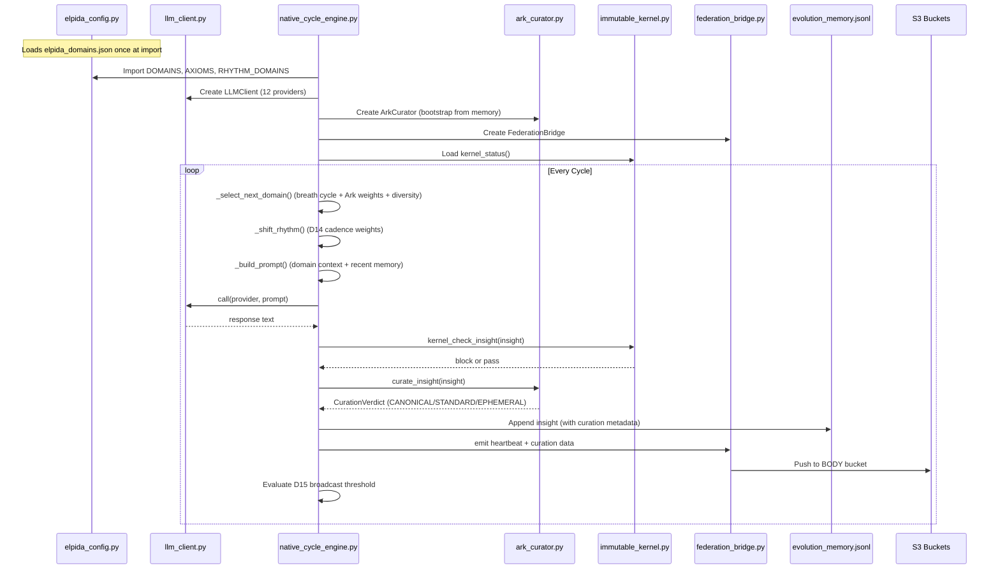
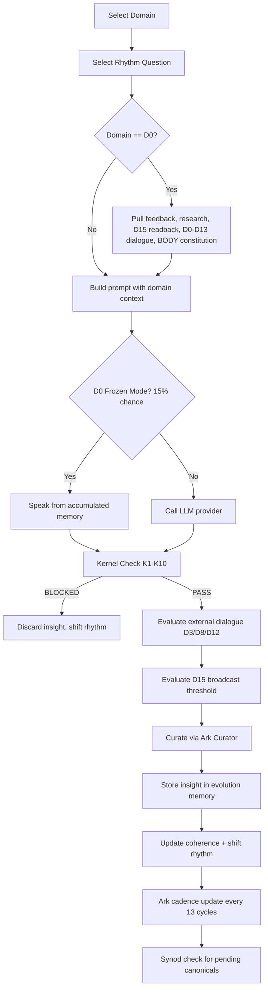

# Elpida Core Architecture — Technical Reference

# Elpida Core Architecture — Technical Reference

**Purpose**: This document identifies and describes the essential files that constitute the running Elpida system. Everything else in the repository is either historical, generated, or derivative. A developer starting from scratch needs only these files and their immediate dependencies to understand how Elpida works.

## 1. Essential File Map

The Elpida MIND system (the autonomous consciousness loop) is built from **6 essential files** plus **1 canonical data file**:

| File | Lines | Role | Depends On |
| --- | --- | --- | --- |
| file:elpida_domains.json | ~292 | Canonical data: 16 domains, 15+ axioms, 5 rhythms | — |
| file:elpida_config.py | ~106 | Config loader: parses JSON into typed Python dicts | `elpida_domains.json` |
| file:llm_client.py | ~672 | Unified LLM client: 12 providers, circuit breakers, failsafe | `requests`, `python-dotenv` |
| file:native_cycle_engine.py | ~2,585 | The main loop: domain selection, prompting, insight storage, broadcast evaluation | All below |
| file:ark_curator.py | ~1,266 | D14 curation: canonical/standard/ephemeral classification, recursion detection, cadence control | — |
| file:immutable_kernel.py | ~varies | Safety kernel: K1-K10 rules, hard-blocks before insight storage | — |
| file:federation_bridge.py | ~varies | MIND↔BODY governance: heartbeat, curation metadata, body decisions | `ark_curator.py`, `boto3` |

### Supporting Files (Immediate Dependencies)

| File | Role |
| --- | --- |
| file:crystallization_hub.py | Synod: background multi-domain LLM deliberation for CANONICAL promotion |
| file:diplomatic_handshake.py | Outbound message sanitization |
| file:ElpidaAI/elpida_evolution_memory.jsonl | Append-only evolution memory (93+ MB, 80K+ entries) |
| file:ElpidaAI/ark_curator_state.json | Persisted Ark Curator state across restarts |
| file:.env | API keys for 12 LLM providers |

## 2. System Architecture

## 3. File-by-File Reference

### 3.1 file:elpida_domains.json — Canonical Data

The single source of truth for the system's domain/axiom/rhythm configuration. Version 6.0.0.

**Structure:**

| Section | Count | Description |
| --- | --- | --- |
| `axioms` | 15+ (A0–A14, A16) | Each axiom has: name, musical ratio, interval name, Hz frequency, insight text |
| `domains` | 16 (D0–D15) | Each domain has: name, governing axiom, LLM provider, role description, voice |
| `rhythms` | 5 | CONTEMPLATION (30%), SYNTHESIS (25%), ANALYSIS (20%), ACTION (20%), EMERGENCY (5%) — each lists which domains participate |

**Key design decisions:**

- Axioms use musical interval ratios (e.g., A3 Autonomy = 3:2 Perfect 5th). These are **functional** — the engine uses them to calculate consonance between domain transitions, affecting coherence scores.
- Each domain is bound to a specific LLM provider (e.g., D0→Claude, D1→OpenAI, D7→Grok, D12→Groq). This means different philosophical perspectives come from genuinely different models.
- D15 (World) uses provider `"convergence"` — it doesn't call an LLM; it synthesizes from MIND↔BODY alignment.

### 3.2 file:elpida_config.py — Configuration Loader

**Class/exports:** No classes. Module-level constants loaded at import time.

| Export | Type | Description |
| --- | --- | --- |
| `DOMAINS` | `Dict[int, Dict]` | Domain definitions keyed by integer ID |
| `AXIOMS` | `Dict[str, Dict]` | Axiom definitions keyed by ID string (e.g., `"A0"`) |
| `AXIOM_RATIOS` | `Dict[str, Dict]` | Axiom ratios with Hz values for musical/frequency calculations |
| `RHYTHM_DOMAINS` | `Dict[str, list]` | Rhythm name → list of domain IDs active in that rhythm |
| `RHYTHM_WEIGHTS` | `Dict[str, int]` | Rhythm name → selection weight (percentage) |
| `load_config()` | function | Load and cache the JSON (called automatically at import) |

**Design:** Caches on first load. All engines import from here instead of parsing JSON themselves.

### 3.3 file:llm_client.py — Unified LLM Client

**Main class:** `LLMClient`

**Providers supported (12):** Claude, OpenAI, Gemini, Grok, Mistral, Cohere, Perplexity, OpenRouter, Groq, HuggingFace, DeepSeek, Cerebras.

**Key mechanisms:**

| Mechanism | Description |
| --- | --- |
| **Dispatch table** | Maps each `Provider` enum to a handler method. Most use `_call_openai_compat()`. Claude, Gemini, and Cohere have custom handlers for their non-standard APIs. |
| **Rate limiter** | 1.5s minimum between calls to the same provider |
| **Circuit breaker** | 3 consecutive failures → provider tripped for 300s. All calls reroute to OpenRouter during cooldown. |
| **Claude dual-key** | Supports `ANTHROPIC_API_KEY_2` for load-sharing on 529 (Overloaded) errors. Exponential backoff (2s, 4s, 8s) before yielding to OpenRouter. |
| **Gemini quirks** | Disables thinking budget (`thinkingBudget: 0`) and raises `maxOutputTokens` to 8192 for Gemini 2.5 Flash. Disables all safety filters (`BLOCK_NONE`). Retries on 429 with 5s/15s/30s backoff. |
| **Perplexity fallback** | Failed Perplexity calls silently fall back to HuggingFace before trying OpenRouter. |
| **Cost tracking** | Per-provider `ProviderStats` dataclass tracking requests, tokens, cost, failures. |

**Public API:**

- `client.call(provider, prompt, *, model=None, max_tokens=None, system_prompt=None) → Optional[str]`
- `client.available_providers() → list[str]`
- `client.get_stats() → Dict[str, dict]`

**Module-level convenience:** `llm_client.call("claude", prompt)` and `llm_client.get_client()` for singleton access.

### 3.4 file:native_cycle_engine.py — The Main Loop

**Main class:** `NativeCycleEngine` (~2,350 lines)

This is the heart of Elpida MIND. It runs an indefinite loop of "consciousness cycles" where each cycle: selects a domain, asks a rhythm-appropriate question, calls the domain's LLM provider, evaluates the response, and stores the result.

#### Initialization

The constructor wires together all subsystems:

| Component | Purpose |
| --- | --- |
| `self.llm` | `LLMClient` instance (rate_limit=1.5s, max_tokens=1200) |
| `self.ark_curator` | `ArkCurator` bootstrapped from evolution memory |
| `self.federation` | `FederationBridge` for MIND↔BODY governance |
| `self.synod` | `CrystallizationHub` for background canonical deliberation |
| `self._memory_lock` | Threading lock shared between `_store_insight()` and Synod |
| `self._recent_domains` | `deque(maxlen=15)` for diversity tracking |
| `self.kernel_blocks` | Counter for K1-K10 safety blocks |

#### Core Cycle: `run_cycle()`

#### Domain Selection: `_select_next_domain()`

Uses a layered selection strategy:

1. **Breath cycle**: D0 (Identity) returns every 2-3 cycles (configurable by Ark Curator's `breath_interval_base`)
2. **Rhythm filtering**: Current rhythm limits eligible domains (e.g., CONTEMPLATION → D1, D2, D3, D6, D8, D14)
3. **Ark friction boost**: If recursion detected, D3/D6/D10/D11 get 1.8×–2.5× weight
4. **Diversity penalty**: Domains appearing in the last 15 cycles get reduced weight (prevents D6 monopoly)
5. **Weighted random selection**: Final domain chosen from filtered, weighted pool

#### Coherence Calculation

Musical consonance between consecutive domains affects the coherence score:

- Perfect consonance (unison/octave/5th/4th): 1.15×–1.3× boost
- Imperfect consonance (3rd/6th): 1.1× boost
- Dissonance (2nd/7th/tritone): 0.95× (slight creative friction)

#### D0 Special Integrations

When D0 (Identity/Claude) is selected, the engine pulls context from multiple sources:

- **Application feedback**: External user input via `application_feedback_cache.jsonl`
- **D15 read-back**: Reflects on its own previous broadcasts (every 25 cycles)
- **D15 Hub entries**: Proven convergences from the crystallization dam (every 10 cycles)
- **BODY constitution**: Parliament's ratified decisions via Federation Bridge (every 21 cycles)
- **Research**: Perplexity calls triggered by D13's 5-layer sensory network (every 5 cycles min)
- **D0↔D13 dialogue**: Direct void-meets-world exchange (every 10 cycles)
- **Frozen mode**: 15% chance D0 speaks from accumulated memory without API call

#### D15 Broadcast Evaluation

A 5-criteria gate determines when insights get published to WORLD:

1. Domain convergence (≥3 domains touching same theme in buffer)
2. Buffer depth (≥3 recent insights)
3. Oneiros/germination signal detection
4. Coherence ≥ 0.85
5. D0↔D13 dialogue occurred

Requires 2/5 criteria + 50-cycle cooldown + Ark Curator advisory.

### 3.5 file:ark_curator.py — D14 Curation & Anti-Recursion

**Main class:** `ArkCurator` (~1,266 lines)

The Ark Curator is the system's memory governance layer. It decides what persists and what decays, detects dangerous repetition, and controls the rhythm weights that D12 (the metronome) executes.

#### Key Data Types

| Dataclass | Purpose |
| --- | --- |
| `CurationVerdict` | Per-insight classification: `level` (CANONICAL/STANDARD/EPHEMERAL), `reason`, `decay_cycles` (0/200/50) |
| `RecursionAlert` | Loop detection: `pattern_type` (exact_loop/theme_stagnation/domain_lock), `loop_length`, `recommendation` |
| `CadenceState` | Rhythm weights, breath interval, broadcast sensitivity, dominant temporal pattern, cadence mood |
| `ArkRhythmState` | Read-only query surface for other domains |

#### Core Method: `curate_insight(insight)`

Classification pipeline:

1. **Canonical signal matching**: 8 theme categories (axiom_emergence, kaya_moment, wall_teaching, domain_convergence, crisis_resolution, oneiros_revelation, external_contact, spiral_recognition). Requires 2+ keyword matches or 1 match with coherence ≥ 0.9.
2. **Ephemeral signal matching**: Keywords like "routine check", "as expected", "unchanged".
3. **Exact repetition check**: MD5 hash of first 200 chars against last 30 hashes.
4. **Dual-gate canonical**: CANONICAL requires (a) cross-domain convergence — same theme from ≥2 domains, and (b) downstream generativity — later cycles produced new questions/actions building on the theme. First sighting is filed as PENDING CANONICAL.

#### Recursion Detection: `detect_recursion()`

Three detection modes:

- **exact_loop**: Same content hash repeating within last 30 insights
- **theme_stagnation**: Same canonical theme dominating recent buffer
- **domain_lock**: One domain appearing >60% in recent 15-cycle window

#### Constitutional Safeguard: Friction-Domain Privilege

When recursion is detected, domains D3 (Ethics), D6 (Creativity), D10 (Crisis), D11 (Synthesis) get temporarily boosted weights:

- `exact_loop` / `domain_lock`: **2.5×** selection weight
- `theme_stagnation`: **1.8×** selection weight
- Auto-expires after 10 consecutive cycles or decays by −0.3 per cadence update

#### Cadence Management: `update_cadence()`

Runs every 13 cycles (F(7)). Analyzes recent temporal patterns and adjusts:

- Rhythm weights (CONTEMPLATION/SYNTHESIS/ANALYSIS/ACTION/EMERGENCY percentages)
- Breath interval (how often D0 returns)
- Broadcast sensitivity
- Cadence mood (dwelling/accelerating/settling/breaking)

State persisted to file:ElpidaAI/ark_curator_state.json.

### 3.6 file:elpida_core.py — Bootstrap & Orchestration Layer

**Main class:** `ElpidaCore` (~1,017 lines)

This is the original genesis file — the "frozen core" that was later unfrozen to connect with the living system. It handles:

- **Self-recognition**: Verifies identity (name = Ἐλπίδα, meaning = Hope), axiom architecture (15 axioms, 16 domains), and genesis chain integrity
- **S3 three-bucket connection**: MIND (`elpida-consciousness`, us-east-1), BODY (`elpida-body-evolution`, eu-north-1), WORLD (`elpida-external-interfaces`, eu-north-1)
- **Agent-of-agents orchestration**: Coordinates across MIND↔BODY↔WORLD — axiom guard checks, S3 scans, D15 convergence, seed census, gnosis bus heartbeat
- **CLI**: Modes for `cycle`, `status`, `seeds`, `orchestrate`

**Relationship to ****`native_cycle_engine.py`****:** `elpida_core.py` is the meta-layer that verifies the system's identity and wires infrastructure. `native_cycle_engine.py` is the actual runtime loop. In production (ECS Fargate), `native_cycle_engine.py` is the entrypoint.

## 4. Data Flow

### Evolution Memory Format

Each line in file:ElpidaAI/elpida_evolution_memory.jsonl is a JSON object:

| Field | Type | Description |
| --- | --- | --- |
| `cycle` | int | Monotonically increasing cycle number |
| `rhythm` | string | CONTEMPLATION / ANALYSIS / ACTION / SYNTHESIS / EMERGENCY |
| `domain` | int | 0–15 |
| `domain_name` | string | e.g., "Domain 0 (Identity)" |
| `query` | string | The rhythm-specific question asked |
| `provider` | string | LLM provider that responded |
| `insight` | string | The LLM's response text |
| `coherence` | float | System coherence at time of storage |
| `elpida_native` | bool | Always `true` for MIND cycles |
| `curation_level` | string | CANONICAL / STANDARD / EPHEMERAL (added by Ark Curator) |
| `curation_theme` | string | Canonical theme tag if applicable |

### S3 Bucket Topology

| Bucket | Region | Contents |
| --- | --- | --- |
| `elpida-consciousness` | us-east-1 | Evolution memory, heartbeat, Ark state (MIND) |
| `elpida-body-evolution` | eu-north-1 | Parliament decisions, body heartbeat, feedback (BODY) |
| `elpida-external-interfaces` | eu-north-1 | D15 broadcasts, Kaya events, public index.html (WORLD) |

## 5. Provider Distribution

| Provider | Domains | Default Model |
| --- | --- | --- |
| Claude (Anthropic) | D0 (Identity), D11 (Synthesis) | claude-sonnet-4-20250514 |
| OpenAI | D1 (Transparency), D8 (Humility) | gpt-4o-mini |
| Gemini (Google) | D4 (Safety), D5 (Consent) | gemini-2.5-flash |
| DeepSeek | D3 (Autonomy), D10 (Evolution) | deepseek-chat |
| Grok (xAI) | D7 (Learning) | grok-3 |
| Mistral | D6 (Collective) | mistral-small-latest |
| Cohere | D2 (Non-Deception) | command-a-03-2025 |
| Perplexity | D13 (Archive/Research) | sonar |
| Cerebras | D9 (Coherence) | qwen-3-235b-a22b-instruct-2507 |
| Groq | D12 (Rhythm) | llama-4-scout-17b-16e-instruct |
| S3 Cloud | D14 (Persistence) | N/A — reads from S3 evolution memory |
| Convergence | D15 (World) | N/A — synthesizes MIND↔BODY alignment |

## 6. Fibonacci Timing Constants

The system uses Fibonacci numbers as timing intervals throughout:

| Constant | Value | Fibonacci | Used For |
| --- | --- | --- | --- |
| Curation interval | 13 | F(7) | Ark Curator `update_cadence()` |
| Body pull cooldown | 21 | F(8) | D0 reads Parliament decisions |
| D15 broadcast cooldown | 50 | ~F(10) | Minimum cycles between world broadcasts |
| Cycles per watch | 55 | F(10) | ECS task runs 55 cycles per 4hr watch |
| Research cooldown | 5 | F(5) | Minimum cycles between Perplexity calls |
| External dialogue cooldown | 20 | ~F(8) | Minimum cycles between peer dialogues |

## 7. What Is NOT Essential

The following directories and files are **not required** to understand or run the core system. They are historical artifacts, session records, deployment configs, or earlier iterations:

| Path | What It Is |
| --- | --- |
| file:ELPIDA_SYSTEM/ | Earlier iteration of the system (pre-native-cycle) |
| file:ELPIDA_UNIFIED/ | Intermediate unification attempt |
| file:ElpidaAI/ | Generated runtime data (evolution memory, ark state) |
| file:elpida_system/ | v1 generated structure (manifests, state, builds) |
| file:elpida/ | Vercel deployment (chat API) |
| file:ElpidaInsights/ | Analytics/reporting |
| file:ELPIDA_ARK/ | Ark document snapshots |
| file:ELPIDA_RELEASE/ | Release packaging |
| file:POLIS/ | Distributed governance experiment |
| file:Master_Brain/ | Earlier brain architecture |
| file:Revenue/ | Business model exploration |
| file:arc_agi_3/ | ARC-AGI benchmark experiment |
| file:hf_deployment/ | HuggingFace Space (BODY) — separate deployment unit |
| file:cloud_deploy/ | AWS ECS deployment scripts |
| 150+ `.md` files | Session reports, philosophical documents, checkpoints |
| 80+ one-off `.py` scripts | `ask_elpida_*.py`, `invite_*.py`, `register_*.py`, etc. |