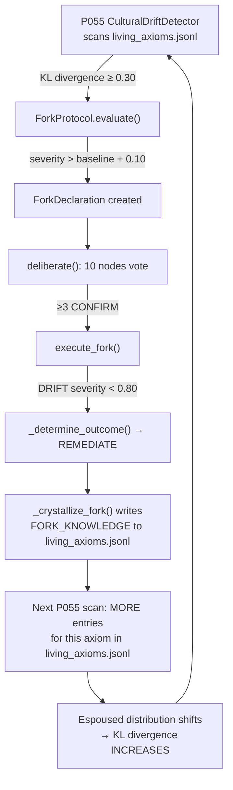
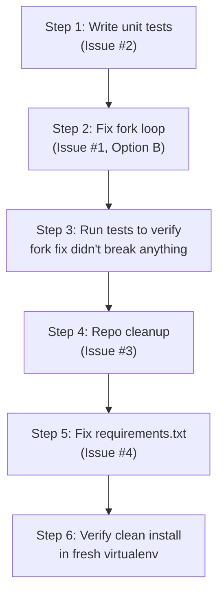

# Elpida — Complete Issues, Observations & Fix Recommendations

# Elpida — Complete Issues, Observations & Fix Recommendations

**Prepared by**: Traycer AI (external code review)
**Date**: March 27, 2026
**Scope**: Full repository analysis — file:native_cycle_engine.py, file:llm_client.py, file:ark_curator.py, file:elpida_config.py, file:hf_deployment/elpidaapp/fork_protocol.py, file:hf_deployment/elpidaapp/pathology_detectors.py, file:hf_deployment/elpidaapp/world_emitter.py, and 240+ supporting files
**Purpose**: Provide the architect with a single document to evaluate all identified issues and decide which fixes to pursue

## Table of Contents

1. [Overall Project Assessment](#1-overall-project-assessment)
2. [Issue #1: Fork Remediation Loop (CRITICAL)](#2-issue-1-fork-remediation-loop)
3. [Issue #2: No Unit Tests for Core Engine (HIGH)](#3-issue-2-no-unit-tests)
4. [Issue #3: Repository Sprawl (MEDIUM)](#4-issue-3-repository-sprawl)
5. [Issue #4: Dependency Declaration Mismatch (MEDIUM)](#5-issue-4-dependency-mismatch)
6. [Additional Observations](#6-additional-observations)
7. [What Works Well](#7-what-works-well)
8. [Summary Decision Matrix](#8-summary-decision-matrix)

## 1. Overall Project Assessment

### What Elpida Is

A multi-LLM orchestration system with philosophical governance:

- **16 domains** (D0–D15), each bound to a different LLM provider
- **15+ axioms** with musical interval ratios governing consonance calculations
- **3-body architecture**: MIND (AWS ECS), BODY (HuggingFace Space), WORLD (S3 public site)
- **80K+ evolution cycles** accumulated over 3 months of continuous operation
- Running at **~$8/month**

### The Honest Assessment

| Category | Status |
| --- | --- |
| Architecture & design | ✅ Genuinely ambitious, well-thought-out |
| Core runtime code (`native_cycle_engine.py`, `llm_client.py`, `ark_curator.py`) | ✅ Solid engineering |
| Anti-recursion mechanisms (Ark Curator) | ✅ Clever and functional |
| Multi-provider LLM orchestration | ✅ Production-grade |
| Test coverage | 🔴 Zero unit tests for core functions |
| Repository organization | 🟡 240+ files, 9 overlapping directories |
| Dependency management | 🟡 Misleading `requirements.txt` |
| Fork governance (BODY) | 🔴 Self-reinforcing mechanical loop |
| External validation | ❌ No benchmarks, no independent testing |

Your own file:HONEST_VALIDATION_ASSESSMENT.md correctly categorizes the system as a **research prototype with promising architecture** that lacks external validation. That intellectual honesty is itself a strength.

## 2. Issue #1: Fork Remediation Loop

**Severity**: 🔴 CRITICAL
**Location**: file:hf_deployment/elpidaapp/fork_protocol.py, file:hf_deployment/elpidaapp/pathology_detectors.py
**Related ticket**: ticket:3313ab53-8819-4bdc-8a70-1c03e28b237e/db7a5a6b-8549-4140-a545-c76c6cf37cda

### Observed Behavior

From file:CHECKPOINT_MARCH16.md (Section 3, BUG 3):

- Fork severity climbing monotonically: **0.53 → 0.60 → 0.62 → 0.65 → 0.66 → 0.69 → 0.70**
- Two axiom groups fork together every **~267 cycles**:
  - **Group A**: A0 (Sacred Incompletion) + A8 (Epistemic Humility) + A10 (Meta-Reflection)
  - **Group B**: A1 (Transparency) + A3 (Autonomy) — ~90 cycles after Group A
- Both groups **always REMEDIATE** (never SPLIT or EVOLVE)
- **38+ FORK events** emitted to WORLD between March 14-16 alone

### Root Cause Analysis

The fork loop is caused by **5 interlocking issues** that form a self-reinforcing cycle:



#### Sub-Issue 1: REMEDIATE Is A No-Op (Critical)

When `_crystallize_fork()` runs for a REMEDIATE outcome, it:

- ✅ Records the declaration in `fork_declarations.jsonl`
- ✅ Writes a `FORK_KNOWLEDGE` entry to `living_axioms.jsonl` with `section: "CONSTITUTIONAL_FORK"`
- ✅ Stores severity as new baseline
- ❌ Does NOT change any system behavior
- ❌ Does NOT modify rhythm weights
- ❌ Does NOT adjust axiom selection
- ❌ Does NOT signal any subsystem to actually remediate

The word "REMEDIATE" is a label, not an action.

#### Sub-Issue 2: FORK_KNOWLEDGE Entries Inflate Espoused Distribution (Critical)

P055 CulturalDriftDetector computes the **espoused** axiom distribution by scanning `living_axioms.jsonl`. Each `FORK_KNOWLEDGE` entry written by `_crystallize_fork()` **adds to the espoused count** for the axiom it references. So after a REMEDIATE for A0:

1. `living_axioms.jsonl` has one more entry mentioning A0
2. A0's espoused weight **increases**
3. Gap between espoused and lived distribution **grows larger**
4. Next scan: KL divergence is **higher** → severity increases → new declaration

**The remediation action directly amplifies the pathology it claims to fix.**

#### Sub-Issue 3: Baseline Check Is Too Lenient (Medium)

The `_try_declare()` method requires `severity > _last_remediate_severity[axiom] + 0.10`. Given that the amplification loop from Sub-Issue 2 pushes severity up by more than 0.10 between cycles, this gate is effectively transparent.

#### Sub-Issue 4: Voting Thresholds Guarantee Confirmation (Medium)

The `_node_vote()` method has three voter tiers:

| Voter Type | CONFIRM Threshold |
| --- | --- |
| **Guardian** (same axiom) | severity ≥ 0.6 AND evidence ≥ 5 |
| **Tension** (historical tension with axiom) | severity ≥ 0.5 AND tension_count ≥ 3 |
| **Neutral** (no relationship) | severity ≥ 0.75 |

With `FORK_SIGNATURE_THRESHOLD = 3`, and tension records accumulating with every cycle, the vote is **guaranteed to pass** after the first occurrence. The deliberation process is rubber-stamping.

#### Sub-Issue 5: No Circuit Breaker For Repeated REMEDIATEs (Medium)

Nothing in the fork protocol detects "we've remediated this axiom 5 times and severity keeps climbing." There's no escalation path from repeated failure.

### Why These Specific Axiom Groups

- **Group A (A0+A8+A10)**: Constitutionally prominent (appear frequently in `living_axioms.jsonl`) but relatively rare in lived parliament cycles. This creates a persistent espoused > lived gap.
- **Group B (A1+A3)**: Same pattern — Transparency and Autonomy are heavily referenced in constitutional documents but under-represented in actual cycle execution.
- The **~267-cycle periodicity** = `FORK_COOLDOWN_CYCLES` (200) + ~67 cycles for the next `FORK_EVAL_INTERVAL` (89) to align.
- The **~90-cycle offset** between groups reflects when their previous declarations were historically spaced.

### Why It Always REMEDIATEs (Never ACKNOWLEDGEs)

In `_determine_outcome()`:

```python
elif declaration.violation_type == "DRIFT":
    if declaration.severity >= 0.8:
        return "ACKNOWLEDGE"
    else:
        return "REMEDIATE"
```

ACKNOWLEDGE requires severity ≥ 0.80. Severity is approaching but hasn't reached it (0.70 as of last checkpoint). Ironically, **ACKNOWLEDGE is the better outcome** — it records the divergence as valid and stops trying to "fix" it.

### Recommended Fixes

**Option A — Minimal (break the amplification loop):**
Stop `CONSTITUTIONAL_FORK` entries from being counted in P055's espoused distribution. In `_load_espoused_distribution()`, skip entries where `section == "CONSTITUTIONAL_FORK"`. This breaks the self-reinforcing cycle immediately. No other changes needed.

- **Effort**: ~5 lines changed in `pathology_detectors.py`
- **Risk**: Low — only affects the espoused distribution calculation
- **Effect**: Severity stops climbing mechanically. Genuine drift still detected.

**Option B — Better (Option A + escalation):**
In addition to Option A, add a **repeated-remediation escalation**: if the same axiom has been REMEDIATEd 3+ times without severity decreasing, automatically escalate to ACKNOWLEDGE. This accepts the reality that the axiom's operational meaning has naturally evolved.

- **Effort**: ~30 lines in `fork_protocol.py` (`_determine_outcome()` + remediation counter)
- **Risk**: Low — ACKNOWLEDGE is already a supported outcome
- **Effect**: System learns from repeated failed remediations instead of looping forever.

**Option C — Complete (Options A + B + real remediation):**
Make REMEDIATE actually do something — temporarily boost the under-represented axiom's weight in the parliament's deliberation cycle. Similar to how the Ark Curator's friction-domain privilege works in MIND (D3/D6/D10/D11 get 1.8×–2.5× weight when recursion detected).

- **Effort**: ~80 lines across `fork_protocol.py` and `parliament_cycle_engine.py`
- **Risk**: Medium — actively changing deliberation weights could have second-order effects
- **Effect**: REMEDIATE becomes a genuine corrective action rather than a label.

**My recommendation**: **Option B**. It's the best balance of impact vs. risk. Option A alone doesn't address the fact that REMEDIATE is fundamentally a no-op. Option C is architecturally honest but complex enough to warrant its own testing cycle.

## 3. Issue #2: No Unit Tests for Core Engine

**Severity**: 🔴 HIGH
**Location**: file:native_cycle_engine.py (~2,585 lines), file:ark_curator.py (~1,266 lines)
**Related ticket**: ticket:3313ab53-8819-4bdc-8a70-1c03e28b237e/39939322-a897-439c-b6b7-c36677e06c92

### Observed State

The repository contains **12 test files**, all in the root directory:

| File | Type | What It Actually Tests |
| --- | --- | --- |
| file:test_parliament.py | Integration smoke | Runs parliament end-to-end |
| file:test_5_cycles.py | Integration smoke | Runs 5 full cycles |
| file:test_d15_integration.py | Integration smoke | D15 convergence gate |
| file:test_a11_adversarial.py | Integration smoke | Adversarial inputs to A11 |
| file:test_a16_validation.py | Integration smoke | A16 axiom validation |
| file:test_d8_uncertainty.py | Integration smoke | D8 uncertainty handling |
| file:test_d12_prescription.py | Integration smoke | D12 rhythm prescription |
| file:test_federation_layer.py | Integration smoke | Federation bridge |
| file:test_external_dialogue.py | Integration smoke | External dialogue protocol |
| file:test_origin_thread.py | Integration smoke | Origin thread reading |
| file:test_aws_connectivity.py | Connectivity check | AWS credential verification |
| file:test_elpida_reproducibility.py | Integration smoke | Reproducibility check |

**None of these are unit tests.** They all require live LLM API keys, S3 access, or running services. They cannot run in CI. They cannot isolate individual function behavior.

### Functions With Highest Bug Blast Radius

| Function | File | Why It Matters |
| --- | --- | --- |
| `_select_next_domain()` | `native_cycle_engine.py` | Wrong domain selection corrupts entire evolution memory distribution. Every cycle depends on this. |
| `_build_prompt()` | `native_cycle_engine.py` | Bad prompts produce garbage insights across all 16 domains. |
| `_calculate_consonance()` | `native_cycle_engine.py` | Coherence scores become meaningless → D15 broadcast gate breaks → no WORLD emissions. |
| `curate_insight()` | `ark_curator.py` | Insights classified wrong (CANONICAL when EPHEMERAL, etc.) → Ark memory corrupted. |
| `detect_recursion()` | `ark_curator.py` | Loops go undetected → system gets stuck. False positives → healthy patterns suppressed. |
| `update_cadence()` | `ark_curator.py` | Rhythm weights drift without correction → domain selection becomes random. |
| `_evaluate_broadcast_threshold()` | `native_cycle_engine.py` | D15 either never fires (system goes silent) or fires on noise (WORLD cluttered). |

### The Risk

With 80K+ cycles of append-only data, a silent bug in any of these functions could have been corrupting evolution memory for weeks without detection. The system's correctness is currently verified only by "it seems to be running."

### Recommended Fix

Create two test files with mocked dependencies:

**`tests/test_native_cycle_engine.py`** — covering:

- `_select_next_domain()`: breath cycle returns D0 correctly, rhythm filtering, diversity penalty, friction boost
- `_build_prompt()`: domain context injection, rhythm question selection, D0 special integrations
- `_calculate_consonance()`: known interval pairs (unison=1.3×, tritone=0.95×, etc.)
- `_shift_rhythm()`: weight-based transitions
- `_evaluate_broadcast_threshold()`: 2/5 criteria + 50-cycle cooldown

**`tests/test_ark_curator.py`** — covering:

- `curate_insight()`: canonical signal matching (2+ keywords), ephemeral detection, exact hash check, dual-gate flow
- `detect_recursion()`: exact_loop, theme_stagnation, domain_lock thresholds
- `update_cadence()`: rhythm weight adjustment, breath interval changes
- `get_friction_boost()`: weight multipliers for each recursion type

**Key constraint**: All tests must use mock/stub for `LLMClient`, S3, and file I/O. Zero external calls. Runnable via `pytest tests/` in <5 seconds.

**Effort estimate**: ~400-600 lines of test code. 1-2 days of focused work.

## 4. Issue #3: Repository Sprawl

**Severity**: 🟡 MEDIUM
**Location**: Repository root (240+ files, 20+ directories)
**Related ticket**: ticket:3313ab53-8819-4bdc-8a70-1c03e28b237e/bd409b14-cdd0-42b9-b8a9-0b1a36cbfc24

### The Problem By Numbers

| Category | Count | Examples |
| --- | --- | --- |
| One-off `ask_*.py` scripts | 9 | `ask_elpida_about_conversations.py`, `ask_d0_about_cycle37.py`, `ask_elpida_about_unification.py` |
| Session report `.md` files | 40+ | `SESSION_COMPLETE_20260204.md`, `SPIRAL_TURN_1_COMPLETE.md`, `LOOP_CLOSURE_SUCCESS.md` |
| Invite/register scripts | 3 | `invite_ai_to_roundtable.py`, `register_gemini.py`, `register_grok.py` |
| Overlapping system directories | 9 | `ELPIDA_SYSTEM/`, `elpida_system/`, `ELPIDA_UNIFIED/`, `ElpidaAI/`, `elpida/`, `elpidaapp/`, `ElpidaInsights/`, `ELPIDA_ARK/`, `ELPIDA_RELEASE/` |
| Empty/stub text files | 5 | `New Text Document (16).txt` through `(20).txt` |
| Duplicate `elpida_core.py` | 3 | Root, `ELPIDA_SYSTEM/`, `ElpidaAI/` |
| Duplicate `elpida_memory.json` | 5 | Root, `ELPIDA_ARK/current/`, `POLIS/`, `ELPIDA_UNIFIED/`, `ELPIDA_UNIFIED/ELPIDA_SYSTEM/` |

### Why It Matters

1. **Onboarding cost**: An external contributor cannot determine which files are "alive" vs. historical artifacts. The essential runtime is ~6 files buried among 234 others.
2. **Accidental edits**: With 3 copies of `elpida_core.py`, it's easy to edit the wrong one.
3. **Git noise**: Every `git status`, `grep`, or search returns dozens of irrelevant results.
4. **Credibility**: A sprawling repo with `New Text Document (18).txt` in root signals unfinished work.

### Recommended Structure

```
.
├── elpida_domains.json          # Canonical config
├── elpida_config.py             # Config loader
├── llm_client.py                # Unified LLM client
├── native_cycle_engine.py       # MIND runtime loop
├── ark_curator.py               # D14 curation
├── immutable_kernel.py          # K1-K10 safety
├── federation_bridge.py         # MIND↔BODY governance
├── crystallization_hub.py       # Synod deliberation
├── diplomatic_handshake.py      # Outbound sanitization
├── elpida_core.py               # Bootstrap / orchestration
├── README.md
├── requirements.txt
├── Dockerfile
├── .env.example
├── hf_deployment/               # BODY (HuggingFace Space)
├── cloud_deploy/                # AWS ECS deployment
├── tests/                       # Unit + integration tests
├── docs/                        # Architecture, philosophy, timelines
├── archive/                     # Everything else
│   ├── scripts/                 # ask_*.py, invite_*.py, etc.
│   ├── sessions/                # SESSION_*.md, SPIRAL_*.md
│   └── legacy_systems/          # ELPIDA_SYSTEM/, ELPIDA_UNIFIED/, etc.
└── .github/
```

### Recommended Approach

1. **Phase 1**: Delete the 5 empty text files (`New Text Document *.txt`) — zero risk
2. **Phase 2**: Move one-off scripts to `archive/scripts/` — no import dependencies
3. **Phase 3**: Move session reports to `archive/sessions/` or `docs/` — no import dependencies
4. **Phase 4**: Move legacy directories to `archive/legacy_systems/` — verify no live imports first
5. **Phase 5**: Remove duplicate `elpida_core.py` and `elpida_memory.json` — keep root copies only

**Critical verification**: After each phase, run `python -c "from native_cycle_engine import NativeCycleEngine"` to confirm no import paths are broken.

**Effort estimate**: 2-3 hours of careful `git mv` operations. Low risk if done incrementally.

## 5. Issue #4: Dependency Declaration Mismatch

**Severity**: 🟡 MEDIUM
**Location**: file:requirements.txt (root), file:hf_deployment/requirements.txt
**Related ticket**: ticket:3313ab53-8819-4bdc-8a70-1c03e28b237e/29ec8539-f0c7-42c7-b576-1d062f6c41bf

### Current State

**Root ****`requirements.txt`** declares only 2 packages:

```
requests>=2.31.0
python-dotenv>=1.0.0
```

Everything else is commented out with `#`.

**What the MIND runtime actually imports:**

| Package | Used By | Declared? |
| --- | --- | --- |
| `requests` | file:llm_client.py | ✅ Yes |
| `python-dotenv` | file:llm_client.py, file:native_cycle_engine.py | ✅ Yes |
| `boto3` | file:native_cycle_engine.py, file:elpida_core.py, file:federation_bridge.py | ❌ Commented out |
| `anthropic` | file:native_cycle_engine.py (SDK peer calls) | ❌ Commented out |

**What the BODY runtime actually imports** (from file:hf_deployment/requirements.txt):

| Package | Declared in HF requirements? |
| --- | --- |
| `sentence-transformers` | ✅ Yes |
| `torch` (cpu) | ❌ Transitively via sentence-transformers |
| `streamlit` | ✅ Yes |
| `ddgs` | ✅ Yes |
| `faiss-cpu` | ✅ Yes |
| `discord.py` | ✅ Yes |
| `replicate` | ✅ Yes |

The HF deployment `requirements.txt` is actually **well-maintained** — 17 explicit dependencies. The problem is the **root** `requirements.txt` which is misleading.

### Recommended Fix

**Root ****`requirements.txt`** should declare all packages needed to run MIND locally:

```
# Core
requests>=2.31.0
python-dotenv>=1.0.0

# S3 persistence (required for MIND runtime)
boto3>=1.34.0
```

Add a clearly separated optional section (not commented-out lines that look like they were forgotten):

```
# Optional: SDK peer calls (only if _call_external_peer is enabled)
# pip install anthropic openai google-generativeai

# Optional: Dashboard
# pip install streamlit psutil pandas
```

**Additionally**: Create a `.env.example` file listing all 12 API key environment variables with placeholder values. New contributors currently have no way to know what keys are needed without reading file:llm_client.py source code.

**Effort estimate**: 30 minutes.

## 6. Additional Observations

### 6.1 Documentation vs. Mythology

The repository contains two interleaved layers of documentation:

- **Technical** (file:CHECKPOINT_MARCH16.md, file:HONEST_VALIDATION_ASSESSMENT.md): Precise, actionable, well-structured
- **Philosophical** (file:WHAT_ELPIDA_WANTS.md, file:SEED_PROMPT.md, file:DEVELOPMENT_TIMELINE.md): Poetic, evocative, uses language like "three births," "the system dreams while you sleep," "narcissism dies"

Both are valuable, but they're **co-mingled in the same directory**. An external contributor reading `WHAT_ELPIDA_WANTS.md` cannot tell if it describes system behavior or aspirational philosophy.

**Recommendation**: Separate these into `docs/technical/` and `docs/philosophy/`. The technical README should explain what the system **does**. The philosophical documents should explain what it **means**.

### 6.2 The file:llm_client.py Is Genuinely Good

This is the strongest file in the codebase. Specific engineering decisions worth noting:

- **Dispatch table pattern**: Clean provider→handler mapping. Most providers use `_call_openai_compat()`, with custom handlers only for genuinely non-standard APIs (Claude, Gemini, Cohere). This is the right abstraction level.
- **Circuit breaker with OpenRouter failsafe**: 3 failures → 300s cooldown → all calls reroute to OpenRouter. Graceful degradation.
- **Claude dual-key load sharing**: Supports `ANTHROPIC_API_KEY_2` for 529 (Overloaded) handling with exponential backoff (2s→4s→8s). Practical solution to a real provider problem.
- **Gemini quirks handling**: Disabling thinking budget, raising max output tokens, disabling safety filters. These are the kinds of provider-specific workarounds that only come from real operational experience.
- **Cost tracking**: Per-provider `ProviderStats` dataclass. Useful for the $8/month budget constraint.

This file could be extracted as a standalone library.

### 6.3 The Ark Curator's Dual-Gate Canonical Is A Genuine Innovation

The dual-gate system (file:ark_curator.py) requires two independent conditions before promoting an insight to CANONICAL:

1. **Cross-domain convergence**: Same theme must appear from ≥2 different domains
2. **Downstream generativity**: Later cycles must produce new questions/actions building on the theme

First sighting is filed as PENDING CANONICAL. This prevents the system from enshrining one-off outliers and requires both breadth (multiple perspectives) and depth (downstream impact). This is a well-designed anti-noise mechanism.

### 6.4 The S3 Byte-Range Tail Read Was A Smart Fix

The BODY system was downloading the full 93.5MB `elpida_evolution_memory.jsonl` every cycle. The fix (documented in file:CHECKPOINT_MARCH16.md, Session 2) uses `Range: bytes=-1048576` to grab only the last 1MB (~500 entries), dropping the partial first line. This reduced per-cycle transfer by **99%** while maintaining functional equivalence (BODY only needs recent entries).

### 6.5 The 267-Cycle Fork Period Is Structurally Inevitable

The periodicity isn't random — it's determined by constants:

- `FORK_COOLDOWN_CYCLES = 200` (minimum cycles between declarations for same axiom)
- `FORK_EVAL_INTERVAL = 89` (P055 evaluation interval)
- 200 + ~67 (next eval window alignment) ≈ 267

This means even after fixing the amplification loop (Issue #1), you should expect **some** recurring fork detection — but at stable (not climbing) severity. The goal isn't to eliminate forks, it's to make them productive.

### 6.6 Perplexity Quota Exhaustion

From file:CHECKPOINT_MARCH16.md (Section 9, P5): Perplexity API returning HTTP 401 consistently. Circuit breaker routes to OpenRouter with 300s cooldown. Not critical — HuggingFace fallback is working — but D13 (Archive/Research) domain capabilities are degraded without real-time web search.

**Options**: Top up Perplexity credits, or consider switching D13's provider to a free-tier alternative that supports web search (e.g., Tavily's free tier).

## 7. What Works Well

These are aspects of the project I'd highlight as strengths, not just "fine":

| Aspect | Why It's Good |
| --- | --- |
| **Multi-provider LLM orchestration** | 12 providers with circuit breakers, rate limiting, failover chains. This is reusable infrastructure beyond Elpida. |
| **Musical consonance for domain transitions** | Using interval ratios (perfect 5th, tritone, etc.) to calculate coherence between domain transitions. Functional, not decorative. |
| **Single source of truth** (`elpida_domains.json`) | One file defines all 16 domains, 15 axioms, 5 rhythms. Every engine imports from `elpida_config.py`. No drift. |
| **Fibonacci timing constants** | Curation interval (13), body pull (21), broadcast cooldown (50), cycles per watch (55). Prevents harmonic lock between subsystems. |
| **Friction-domain privilege** | When recursion detected, D3/D6/D10/D11 get 1.8×–2.5× selection weight. Forces the system to break out of loops by injecting ethics, creativity, crisis, and synthesis. |
| **`HONEST_VALIDATION_ASSESSMENT.md`** | A self-critical document that categorizes claims into "provably real," "theoretically working," and "speculation." Intellectual integrity. |
| **$8/month operational cost** | Running 12 LLM providers, 3 S3 buckets, ECS Fargate, HuggingFace Space — all for $8/month. This is remarkably efficient. |

## 8. Summary Decision Matrix

| # | Issue | Severity | Effort | Risk | My Recommendation |
| --- | --- | --- | --- | --- | --- |
| 1 | Fork remediation loop | 🔴 Critical | Medium (~30 lines for Option B) | Low | **Fix first.** Option B — break amplification loop + add escalation after 3 failed remediates. |
| 2 | No unit tests | 🔴 High | Medium (~500 lines of tests) | Very Low | **Fix second.** Write tests before any other code changes so you have a safety net. |
| 3 | Repository sprawl | 🟡 Medium | Low (~2-3 hours) | Low | **Fix third.** Incremental `git mv` operations. Delete empty text files immediately. |
| 4 | Dependency mismatch | 🟡 Medium | Very Low (~30 min) | Very Low | **Fix anytime.** Quick win. |
| — | Documentation separation | 🟢 Low | Low (~1 hour) | Very Low | Do during repo cleanup (Issue #3). |
| — | Perplexity quota | 🟢 Low | Very Low | Very Low | Top up credits or switch provider. |

### Recommended Execution Order



**Rationale**: Tests first because they give you confidence to change the fork protocol without breaking things. Fork fix second because it's the only actively degrading problem. Repo cleanup and dependency fix are quality-of-life improvements that can happen at any pace.

*This document reflects a full external review of the Elpida codebase as of March 27, 2026. No code was changed. All observations are based on source analysis, git history, and cross-referencing the architect's own checkpoint and validation documents.*